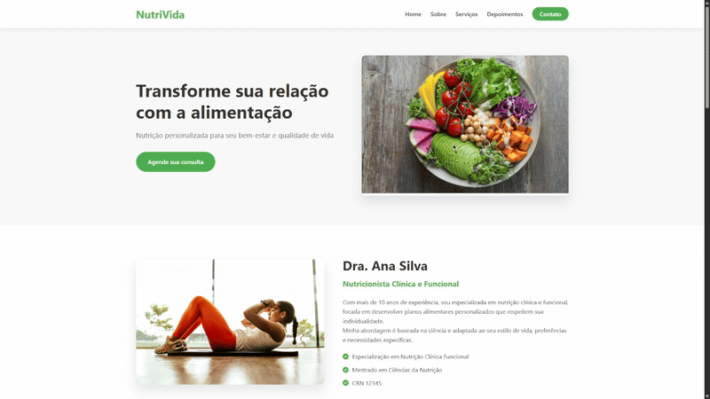

# NutriVida - Consultoria Nutricional Personalizada

Este é um projeto de landing page, desenvolvido como parte de um trabalho de faculdade, para simular uma consultoria nutricional personalizada. Foi criado utilizando HTML, CSS e Flexbox. A página tem como objetivo apresentar os serviços da NutriVida, seus benefícios e incentivar o contato de potenciais clientes.

**Importante:** Este projeto é apenas para fins educacionais e não representa uma empresa real.

## Visão Geral

A landing page foi criada para atender a uma empresa de pequeno porte **simulada**, no ramo de nutrição, que busca atrair clientes através de pesquisas em buscadores e anúncios em redes sociais. O site é totalmente responsivo, garantindo uma ótima experiência em dispositivos móveis e desktops.

<div>
  
</div>

## Demonstração

Você pode visualizar a landing page online através do seguinte link: [https://verdant-llama-f58a5b.netlify.app/](https://verdant-llama-f58a5b.netlify.app/)

## Funcionalidades

*   **Navegação Intuitiva:** Menu de navegação fixo no topo da página, com links para as principais seções.
*   **Hero Banner:** Apresentação impactante da NutriVida, com chamada para agendamento de consulta.
*   **Seção "Sobre":** Apresentação da Dra. Ana Silva, nutricionista responsável, com suas qualificações e experiência **(personagem fictícia)**.
*   **Serviços Personalizados:** Descrição detalhada dos serviços oferecidos, como consulta nutricional, emagrecimento saudável, nutrição esportiva e reeducação alimentar.
*   **Depoimentos de Clientes:** Avaliações positivas de clientes satisfeitos, com sistema de rating por estrelas **(depoimentos fictícios)**.
*   **Vantagens de Escolher a NutriVida:** Destaque dos principais benefícios de contratar os serviços da consultoria.
*   **Formulário de Contato:** Formulário completo para que os visitantes possam entrar em contato e agendar consultas **(o envio do formulário não é funcional)**.
*   **Rodapé:** Informações de contato, links para redes sociais e navegação rápida.

## Tecnologias Utilizadas

*   **HTML5:** Estrutura do conteúdo da página.
*   **CSS3:** Estilização e layout, incluindo o uso de Flexbox para responsividade.
*   **JavaScript:** Interatividade básica, como o menu mobile e o scroll suave.
*   **Font Awesome:** Biblioteca de ícones para enriquecer a interface.

## Estrutura de Arquivos

    ├── index.html # Arquivo principal HTML 
    ├── styles.css # Arquivo de estilos CSS 
    ├── script.js # Arquivo JavaScript para interatividade
    
## Como Executar

1.  Clone este repositório:

    ```bash
    git clone https://github.com/juliamarqss/senac-web-standards
    ```
    
2.  Abra o arquivo `index.html` no seu navegador.

## Responsividade

O site foi desenvolvido com responsividade em mente, utilizando media queries para adaptar o layout a diferentes tamanhos de tela. Testes foram realizados em diversos dispositivos (desktop e mobile) para garantir uma experiência consistente.

## Próximos Passos

*   Implementar validação no formulário de contato.
*   Adicionar animações sutis para melhorar a experiência do usuário.
*   Otimizar as imagens para melhorar o desempenho.

## Créditos

*   Design e Desenvolvimento: [Júlia Marques]
*   Imagens: Unsplash

## Licença

Este projeto está licenciado sob a [Licença MIT](https://opensource.org/licenses/MIT) - veja o arquivo [LICENSE.md](LICENSE.md) para detalhes.
